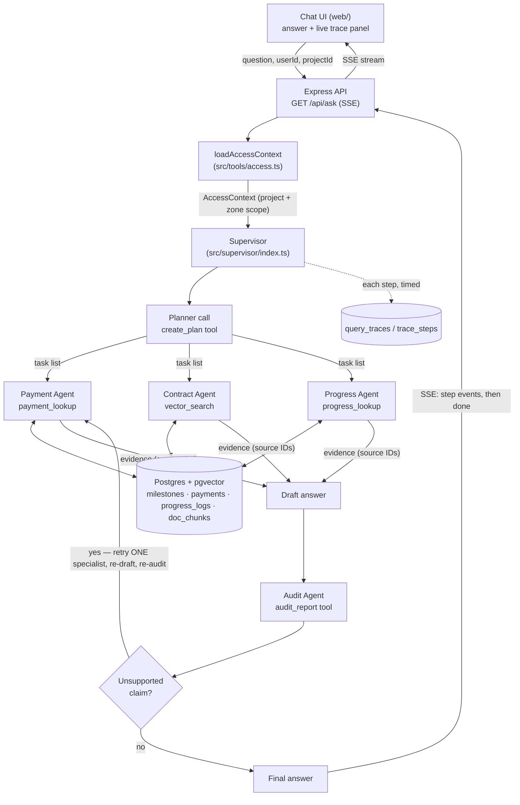

# Architecture

## Request flow

## Agent responsibilities

| Agent | Does | Never does |
|---|---|---|
| **Supervisor** | Splits a compound question into per-agent tasks, delegates, merges evidence, drafts, sends the draft to Audit, resolves/reports uncertainty, produces the final cited answer | Fabricate evidence, skip Audit on a compound question |
| **Payment** | Typed payment/milestone lookup via `payment_lookup` — exact amount, status, paid amount, due date | Generate or accept arbitrary SQL |
| **Contract** | pgvector search via `vector_search` — returns clause text + page number as evidence | Summarize vaguely without a source chunk |
| **Progress** | Searches progress logs / inspection-photo metadata via `progress_lookup`; reports missing or conflicting records | Assume evidence exists because it's plausible |
| **Audit** | Extracts claims from the draft, checks each against retrieved evidence, flags unsupported/contradicted claims, requests **at most one** targeted retrieval retry | Add new interpretation — verification only, no new claims |

The Supervisor/Audit boundary is the one place this design tends to blur:
the Supervisor synthesizes and decides what to ask for; Audit strictly
checks the draft against evidence and never introduces its own
interpretation. Both system prompts (`src/supervisor/index.ts`,
`src/agents/audit-agent.ts`) state this explicitly.

## Evidence and access control

Every specialist tool (`src/tools/payment-lookup.ts`,
`vector-search.ts`, `progress-lookup.ts`) takes a resolved
`AccessContext` — never a raw user ID — and bakes the project/zone
restriction directly into its SQL `WHERE` clause. A contractor scoped to
one zone gets zero rows for another zone regardless of how the tool is
called (explicit zone filter, no filter at all, milestone-name-only); see
`tests/access-control.test.ts` for the automated proof. Evidence returned
from every tool carries a `sourceId`, `sourceType` (`row` | `chunk`), and a
`specialist` tag, so the final answer can trace every cited fact back to
where it came from.
