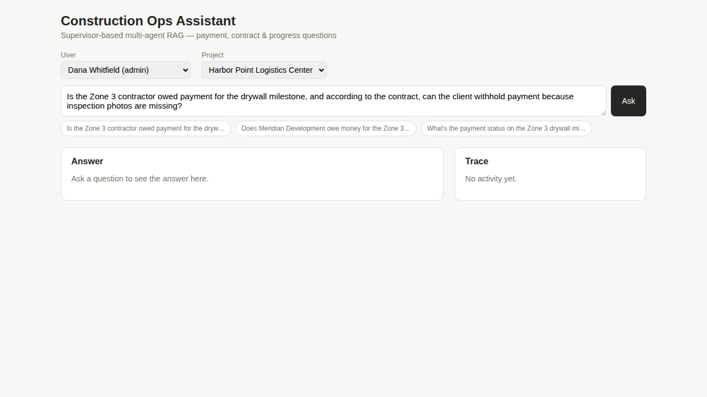
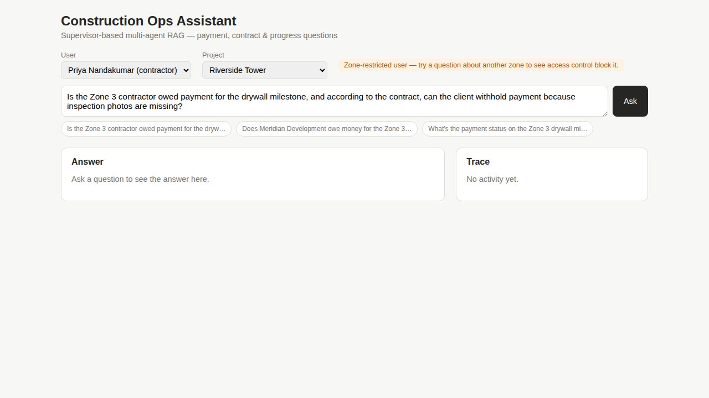

# Demo

**No narrated screen recording is included.** Recording one meaningfully
needs two things this build environment doesn't have: a live
`ANTHROPIC_API_KEY`/`OPENAI_API_KEY` (so the trace panel actually fills
with `[payment-agent]`, `[contract-agent]`, `[progress-agent]`,
`[audit-agent]` steps instead of erroring out on the first call), and
screen-recording/audio tooling, neither available in the sandbox this was
built in. What follows is the honest substitute: real screenshots of the
actual running app, and a script for recording a real one once live keys
are available.

## What these screenshots actually show

All three were taken by driving the real app (Vite dev server + Express
API + seeded Postgres) with Playwright — not mocked up.

**1. Initial state** (`screenshots/01-initial.png`) — the chat UI on load:
user/project selectors populated live from `GET /api/context`, the
flagship question pre-filled, and phrasing quick-select chips.

**2. Zone-restricted contractor selected** (`screenshots/02-contractor-hint.png`)
— picking Priya Nandakumar (seeded as a Zone-3-only contractor) surfaces a
hint that access control will actually block a question about another
zone. This isn't decorative copy — `tests/access-control.test.ts` proves
the block, and this UI state is how a user would discover it.

**3. The error path, working as designed** (`screenshots/03-error-path.png`)
— asking the flagship question in this key-less environment. The SSE
connection opens, `trace_id` fires (a `query_traces` row is created — see
`architecture.md`), and then the real Anthropic API call fails on missing
credentials. The UI renders that as a clean error banner and resets to a
ready state — no crash, no stuck spinner. **With live keys, this same flow
instead streams a growing trace panel and ends with a real cited answer**;
this screenshot is honest evidence the failure path works, not a stand-in
for the success path.

## Script for recording a real demo

Once `ANTHROPIC_API_KEY` and `OPENAI_API_KEY` are set (see the root
README's Setup section) and `npm run api:dev` + `cd web && npm run dev`
are both running:

1. Open the chat UI, leave the default user (Dana Whitfield, admin) and
   project (Riverside Tower) selected.
2. Ask the pre-filled flagship question. Narrate the trace panel as it
   fills in real time: plan created → each specialist queried → evidence
   collected → Audit's verdict → (if triggered) one retry → final answer.
3. Read the final answer aloud, pointing out that it distinguishes what
   the payment DB says / what the contract permits / what the progress
   logs show, and states what remains uncertain rather than guessing.
4. Switch the user to Priya Nandakumar (Zone 3 contractor) and ask a
   question about Zone 1 — show the access-control block in action.
5. Run `npm run eval:run -- 10` in a terminal alongside, to show the
   three-way comparison producing `eval/report.md` with real numbers.

That's the five-minute version of what this project is actually for.
